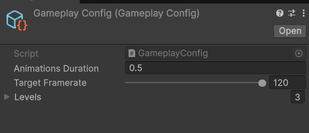
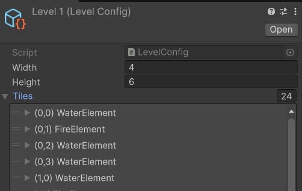
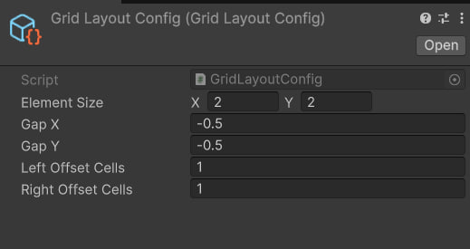

<h1 align="center">Test Task at Open My Games</h1>

# Task Description

[Description](https://docs.google.com/document/d/18Da2pMWS0g-YczhCYPDZDKoXbEIo4qvG-qTU9SKuUho/edit?usp=sharing)

## Result

📱 [APK](Result.apk)

## Configurability

* **Gameplay**

* **Levels**

* **Elements**

* **Grid**

* **Balloons**

## Stack:
* **Unity 6**
* **DOTween**
* **Vcontainer**
* **Newtonsoft.Json**