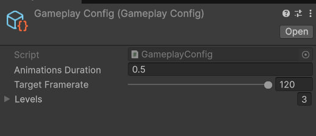
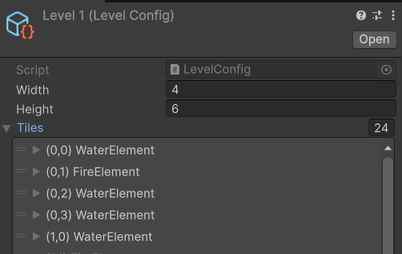
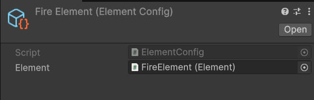
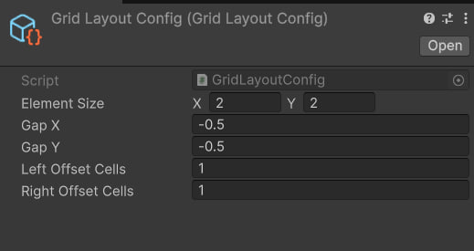
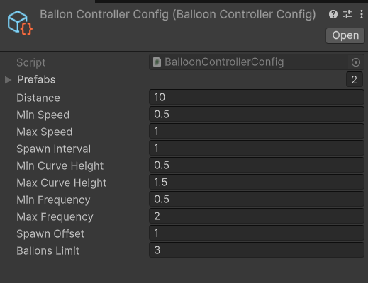

<h1 align="center">Тестовое задание в компанию Open My Game</h1>

# Описание задачи

[Описание](https://docs.google.com/document/d/18Da2pMWS0g-YczhCYPDZDKoXbEIo4qvG-qTU9SKuUho/edit?usp=sharing)

## Результат

📱 [APK](Result.apk)

## Конфигурируемость

* **Геймплей**

* **Уровни**

* **Элементы**

* **Сетка**

* **Настройка поведения шаров**

## Стек:
* **Unity 6**
* **DOTween**
* **Vcontainer**
* **Newtonsoft.Json**
